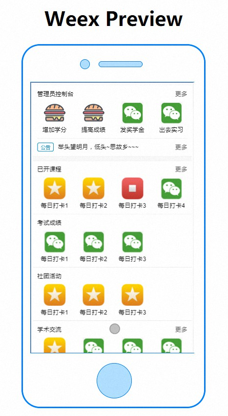
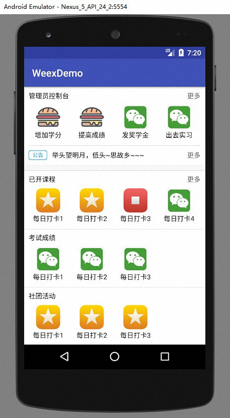

# weex-demo

> 模仿钉钉工作页面，基本完成

可直接访问 https://zphhhhh.github.io/weex-demo/index.html 预览 Web 端

  

## 预览

```bash
npm install

npm run dev

npm run serve
```

- 预览 Web 端：  
https://zphhhhh.github.io/weex-demo/index.html
- 预览 Weex 端：  
使用 Android Studio 打开功能并运行
- 使用 Playground：
https://zphhhhh.github.io/weex-demo/android/app/src/main/assets/app.weex.js

## 文件结构

* `src/*`: 源码
    - `components`: 组件
    - `constants`: 存放常量
    - `data`: 存放数据
    - `App.vue`: 页面入口
* `android`: Android (native for Weex)
* `app.js`: Weex 入口
* `index.html`: Weex Web 端预览

## 思路

- 定义`IconItem.vue`组件作为图标列表的项，定义`IconDrawer.vue`组件作为装满同类图标项的抽屉（列表），同时`IconDrawer.vue`预留`footer`插槽，方便自定义，在钉钉中的`管理员控制台`模块中使用了`footer`，即下面的 `SliderNews.vue`。
- 定义`SliderNews.vue`作为轮播消息组件，这里使用的 `<slider>` 仅支持左右滑动，因此与原生钉钉的消息模块有所差异，可改为动画实现上下滚动。
- 定义常量、数据文件，与页面分离。
- 修改 webpack 配置文件将 app.weex.js 输出到 android 目录下。


## 遇到的问题？

- 子组件好像不支持`:class`绑定？  
原因：后发现问题是，父组件若使用了`<style scoped>`，则不支持给子组件使用`:class`绑定，这点是与 Vue 不同的。后去掉了父组件的 `scoped`。
- 集成到 Android 开发环境时不显示 Weex 页面？  
原因：使用 Android Studio 新建工程时在`AndroidManifest.xml`配置文件中的`Application`下没有加入`android:name`属性（这个坑填了很久，官方文档没有说明。。后来细想，其实 React Native 也是类似的。。）加入之后类似下面：
```xml
<!-- 在下面加入 `android:name=".WXApplication"`  -->
<application
    android:name=".WXApplication"
    android:allowBackup="true"
    android:icon="@mipmap/ic_launcher"
    android:label="@string/app_name"
    android:roundIcon="@mipmap/ic_launcher_round"
    android:supportsRtl="true"
    android:theme="@style/AppTheme">
    <activity android:name=".MainActivity">
        <intent-filter>
            <action android:name="android.intent.action.MAIN" />

            <category android:name="android.intent.category.LAUNCHER" />
        </intent-filter>
    </activity>
</application>
```
- Android 图片无法加载？  
原因：需自己手动实现图片加载，这里用了 Picasso 开源库，请移步：https://github.com/square/picasso
- Web 端正常而 Weex 端布局出错？  
原因：由于平台问题，Weex 端不支持很多 Web 端的 CSS 属性，比如`border: 1px solid #ccc`要分开写，`flex`布局默认值不同最好写完整等等。

## 其他
- 项目中使用的图片出自网上资源，仅做学习之用。


## 关于 Weex
在这个 demo 之前只是听说过 Weex，大概和 React Native 是类似的，而没有真正接触过。这两天写完 demo 后还是有一些心得。。趁机记下来~~~  
- 整体上， Weex 仍处于长期开发阶段，官方提供的组件仍然很有限，我自己认为应该处于 alpha 版本，若用在真实项目中，在踩坑方面估计会有不小的难度。
- Weex 使用 Vue 做前端页面的开发，Vue 的开发体验个人以为要比 React 要更清晰流畅一些，当然这和 React 入门门槛高有一定的联系，也可能是我开发经验少的幻觉...
- 无论是 Weex 还是 React Native，要想用在实际项目中，工程师一定是要有非常不错的能力，而且要能驾驭 Native Android/iOS，这样想来，门槛还是非常高的，尤其在这前端技术迅速变迁的几年...
